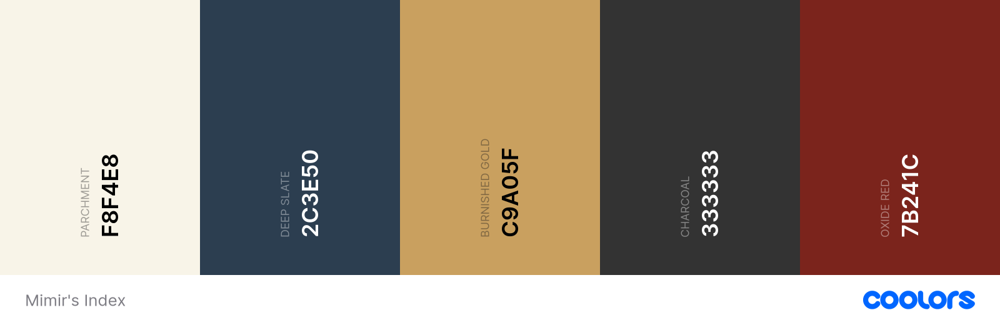

# Mimir's Index

## By Ed Chalk

[View the live project here](PLACEHOLDER)

[View the repository here](https://github.com/edchalk96/mimirs_index)

## Table of Contents

1. [Background](#background)
2. [User Experience (UX) | The 5 Planes](#user-experience-ux--the-5-planes)
    1. [Strategy Plane](#strategy-plane)
    2. [Scope Plane](#scope-plane)
    3. [Structure PLane](#structure-plane)
    4. [Skeleton Plane](#skeleton-plane)
    5. [Surface PLane](#surface-plane)
3. [Technologies Used](#technologies-used)
4. [Testing](#testing)
5. [Deployment](#deployment)
6. [Credits](#credits)

---

## Background

Mimir’s Index serves as a comprehensive digital compendium of Norse mythology, cataloging everything from deities and legendary creatures to mystical artifacts. Designed for scholars, researchers, and enthusiasts alike, the platform provides detailed entries paired with relevant stanzas from primary sources. Beyond a simple archive, it functions as a collaborative knowledge hub where users can contribute research and engage in scholarly discussion through community comments. Furthermore, this project represents a significant milestone in my professional development, serving as my Milestone Project 3 for the Code Institute Level 5 Diploma in Web Application Development and a cornerstone of my technical portfolio.

---

## User Experience (UX) | The 5 Planes

PLACEHOLDER

1. The Strategy Plane
2. The Scope Plane
3. The Structure Plane
4. The Skeleton Plane
5. The Surface Plane

---

### Strategy Plane

### *Project Goals*

The primary objective of this project is to establish a collaborative knowledge hub dedicated to Norse mythology, where a community of users can expand the collective database and exchange diverse interpretations of ancient stanzas and poems. To achieve this, the platform will implement the following core features:

- Poetic Archive: A dedicated space to browse and study various stanzas and mythological poems.
- Advanced Search: Robust search functionality to quickly locate specific deities, creatures, or artifacts.
- Dynamic Profiles: Detailed information pages for mythological entities, including curated lists of their appearances across primary sources.
- Community Engagement: Interactive comment sections on every entry to facilitate the sharing of ideas and scholarly insights.
- Administrative Oversight: A moderation system ensuring that all user-generated posts, edits, and deletions are verified before publication.

### *User Stories*

The primary objective for users is to explore the multifaceted world of Norse mythology while deepening their understanding of its various historical and cultural aspects. This scope extends beyond passive reading to active participation, allowing contributors to enrich the collective knowledge base and engage with fellow community members to exchange insights and interpretations of specific historical texts.

#### First Time User Goals

- **Intuitive Discovery**: As a first-time user, I want to arrive at a landing page with clear, intuitive navigation so that I can easily explore the site's content.
- **Curated Exploration**: As a first-time user, I want to be presented with a featured "random" post to encourage immediate engagement with the mythology.
- **Seamless Browsing**: As a first-time user, I want to access a paginated archive of posts so that I can browse the collection without being overwhelmed by information.
- **Deep-Dive Reading**: As a first-time user, I want to select a specific post to access the full text, historical context, and other relevant information
- **Interconnected Lore**: As a first-time user, I want to click on referenced characters or mythical objects within a text to be instantly directed to their detailed profiles.
- **Targeted Research**: As a first-time user, I want to search for specific entities and be presented with a comprehensive profile that includes background information and a curated list of their textual appearances.
- **Social Proof & Insights**: As a first-time user, I want to view community comments on posts to gain additional perspectives and insights from other members.
- **Account Creation**: As a first-time user, I want to register for an account so that I can return as a recognized member and unlock further interactive features.

#### Returning/Frequent User Goals

- **Secure Authentication**: As a returning user, I want to securely log in and out of my account to manage my personal contributions and profile.
- **Knowledge Contribution**: As a returning user, I want the ability to contribute new entries to the knowledge base, ensuring the archive continues to grow.
- **Content Management (CRUD)**: As a returning user, I want to edit or delete posts I have previously created to maintain the accuracy and quality of my contributions.
- **Entity Creation**: As a returning user, I want to generate new profiles for characters or mythical objects that are not yet represented in the index.
- **Profile Refinement**: As a returning user, I want to update existing entity profiles with new information or historical findings as they arise.
- **Literary Analysis (Kennings)**: As a frequent user, I want to associate and search for specific kennings (metaphorical compounds) within character profiles to deepen the linguistic research of the site.
- **Community Dialogue**: As a frequent user, I want to post comments on existing entries to engage in active discussion and share interpretations with fellow enthusiasts.
- **Comment Moderation**: As a frequent user, I want the ability to update or refine my own comments to better reflect my evolving thoughts or correct errors.
- **Advanced Relational Search**: As a frequent user, I want to search the archive for complex interactions where two or more specific characters or objects appear together in the same text.
- **Developer Communication**: As a frequent user, I want a direct method to contact the developer to provide feedback, report issues, or suggest site improvements.

#### Site Administrator Goals

- **Full CRUD Lifecycle Management**: As a site admin, I want comprehensive permissions to create, read, update, and delete posts, comments, and entity profiles to ensure the platform’s content remains accurate and high-quality.
- **Editorial Staging**: As a site admin, I want the ability to save posts and profiles as drafts, allowing for ongoing research and refinement before they are officially published to the live site.
- **Content Moderation & Verification**: As a site admin, I want to review, approve, or reject user-submitted contributions—including posts, profiles, and comments—to safeguard the validity of the knowledge base and prevent the publication of irrelevant, duplicated or inaccurate material.

#### Opportunities Matrix

| **Oppurtunity**                            | **Importance** | **Viability/Feasibility** | **Total Score** |
| ------------------------------------------ | :------------: | :-----------------------: | :-------------: |
| **User Authentication (Login/Out)**        | 5              | 5                         | 10              |
| **Full CRUD (Posts & Profiles)**           | 5              | 4                         | 9               |
| **Content Moderation (Admin Approval)**    | 5              | 3                         | 8               |
| **Interconnected Lore (Linking Entities)** | 4              | 5                         | 9               |
| **Community Comments & Edits**             | 4              | 4                         | 8               |
| **Editorial Staging (Drafts)**             | 3              | 4                         | 7               |
| **Specific Profile Searching**             | 4              | 4                         | 8               |
| **Advanced Relational Search**             | 3              | 2                         | 5               |
| **Kenning Search/Analysis**                | 3              | 2                         | 5               |
| **Developer Contact Form**                 | 3              | 5                         | 8               |
|                                            | **38**         | **37**                    |                 |

---

### Scope Plane

While the nearly 1:1 ratio between importance and feasibility indicates a well-balanced project scope, certain constraints regarding the development timeline and current technical requirements necessitate a phased rollout. Consequently, not all opportunities identified in the matrix will be included in the initial release. Specifically, *Advanced Relational Search* and *Kenning Search/Analysis*—the two lowest-scoring features in the oppurtunity matrix—have been moved to the project's future roadmap. Excluding these complex features ensures a stable and high-quality deployment of the core platform. The following features have been finalized as within scope for the initial development phase of Mimir’s Index:

- User Authentication System: A secure login and registration framework allowing users to login and out.
- Centralized Knowledge Base (CRUD): A robust database of Norse mythology entries, enabling authorized users to create, read, update, and delete content.
- Entity Profile System: Dedicated, detailed profiles for deities, creatures, and mythical objects, providing background lore and historical context.
- Standardized Search Functionality: A keyword-based search tool to help users quickly locate specific characters, objects, or themes.
- Interconnected Lore Engine: Dynamic links within text entries that allow users to navigate directly to relevant character or object profiles.
- Community Interaction Hub: Integrated comment sections on posts to facilitate scholarly discussion and the exchange of insights.
- Admin Moderation Dashboard: A specialized interface for site administrators to verify, approve, or reject user-submitted content before it goes live.
- Editorial Staging (Drafting): The ability for administrators to save and refine incomplete entries in a "Draft" state prior to formal publication.
- Developer Contact Interface: A dedicated communication channel for users to provide feedback or report issues directly to the developer.

---

### Structure Plane

Mimir’s Index will feature a cohesive aesthetic deeply rooted in Norse mythology. Every design element—from typography and color palette to imagery—is intentionally curated to reflect this theme while prioritizing accessibility. By balancing thematic immersion with high readability, the site ensures a seamless experience for anyone looking to engage with the lore, whether for academic study or personal interest.

#### *Layout*

To ensure an intuitive user experience and prevent information overload, the site utilizes a streamlined landing page designed for efficient navigation. The home page centers on three primary access points, presented as thematic cards:

- The Archive: Access the complete collection of mythological texts and stanzas.
- The Entity Index: Browse detailed profiles of gods, creatures, and mythical objects.
- The Forge: A submission portal where registered users can propose new content for administrative review.

#### *Colour Scheme*

To honor the site's historical purpose, the palette was curated to evoke the atmosphere of the Viking Age while prioritizing a seamless user experience. Consequently, the color scheme for Mimir’s Index bridges the gap between ancient manuscript aesthetics and modern digital accessibility standards.

Colour pallete was generate using [Coolors](https://coolors.co/)

- **#F8F4E8 | Parchment (Primary Background)**

    This off-white colour will be used as the main background colour providing a soft, warm base to reduce eye strain whilst simulating parchment paper, mimicing the look of aged vellum or sheepskin manuscripts.

- **#2C3E50 | Deep Slate (Structural Elements)**

    Used primarily for headers, navigation bars, and UI cards, this shade represents the cold stone of the Nordic mountains. It provides a stable structural framework and offers high contrast for light-colored accents

- **#C9A05F | Burnished Gold (Accents & CTA)**

    This color is reserved for interactive elements and calls to action (CTAs). While gold symbolizes power and divinity in Norse mythology, it is used here to represent the "wealth of knowledge" and the mystical nature of the artifacts indexed within the site.

- **#333333 | Charcoal (Primary Typography)**

    This deep grey serves as the main color for body text. It offers a sharp, authoritative alternative to Deep Slate, ensuring maximum legibility against the Parchment background while maintaining a sophisticated look.

- **#7B241C | Oxide Red (System Alerts & Destructive Actions)**

    Reserved strictly for alerts, errors, and "Delete" actions, this deep red mimics the cinnabar ink used for rubrics and emphasis in medieval texts. It provides a clear visual cue for critical interactions while staying within the historical theme.

#### *Typography*

- **Display & Header Typography: Norse / NorseBold**

    For primary headings, titles, and sub-titles, the site will utilise the Norse typeface family. This font is visually evocative of the Viking Age and immediately establishes the site’s thematic identity. The assets were sourced from [1001 Fonts](https://www.1001fonts.com/norse-font.html#license) and will be served locally by being integrated into the project’s directory and imported via `@font-face` within the CSS files.

- **Body Typography: EB Garamond**

    For the main body of text, EB Garamond will be used to maintain a consistent "manuscript" aesthetic. This classic serif typeface is specifically chosen for its elegance and exceptional readability during long-form study. It will be imported directly into the project via [Google Fonts](https://fonts.google.com/specimen/EB+Garamond).

- **Fallback Strategy**

    To ensure a consistent user experience in the event of an import failure, a robust CSS stack will be implemented. The primary fallback for all text will be Garamond, followed by the generic serif family, ensuring the "manuscript" feel is preserved even under limited connectivity.

#### *Imagery & Iconography*

To maintain thematic consistency, all visual assets are carefully selected to align with the historical and mythological context of the project.

- **Thematic Hero Image**: The landing page features a prominent hero image of Yggdrasil, the world tree. This serves as a powerful metaphor for the "interconnected lore" within the database, representing the foundational structure that links the various realms of knowledge across the site.

- **Entity Profiles**: Each character or mythical object profile includes a relevant visual representation. To ensure a seamless user experience, a default placeholder image is automatically assigned to any newly published profile that does not yet have a custom asset.

- **AI-Assisted Asset Creation**: Given the niche nature of certain Norse subjects, Google Gemini will be utilised to generate high-quality, bespoke imagery where traditional stock assets are unavailable. This includes the project’s custom logo, ensuring a unique and cohesive brand identity.

- **Responsive Design**: All imagery is implemented with fluid responsiveness, utilising CSS properties to ensure assets scale proportionally across mobile, tablet, and desktop viewports.

- **Runic Symbology**: In place of standard bullet points, unordered lists will utilise UTF-8 runic characters (sourced from [W3Schools](https://www.w3schools.com/charsets/ref_utf_runic.asp)). This subtle typographic detail reinforces the norse mythology and ancient manuscript aesthetic in every corner of the interface.

#### ERD??

---

### Skeleton Plane

#### *Wireframes*

[Canva's Online WireframeTool](https://www.canva.com/online-whiteboard/wireframes/) was utilised to create the site’s wireframes, serving as the foundational architectural concept and initial visualization for the project. These blueprints define the structural layout of every page, ensuring a consistent user experience and logical flow before the development phase began.

To guarantee cross-device scalability, wireframes were drafted for multiple screen sizes, ensuring the design remains responsive and functional across mobile, tablet, and desktop viewports. This proactive planning stage allows for a "mobile-first" approach, ensuring the Norse-themed aesthetic translates seamlessly to all users.

Please find the detailed wireframes for each page below, including variations for viewport sizes:

- **Home Page (Logged In vs Logged Out)** | [View](./documentation/wireframes/mimirs-index-home-page.pdf)

- **The Edda Library** | [View](./documentation/wireframes/mimir's-index-the-edda-library.pdf)

- **The Posts Page** | [View](./documentation/wireframes/mimirs-index-post-page.pdf)

- **The Entity Archive** | [View](./documentation/wireframes/mimirs-index-the-entity-archive.pdf)

- **Entity Profile Page** | [View](./documentation/wireframes/mimirs-index-entity-profile-page.pdf)

- **The Forge** | [View](./documentation/wireframes/mimirs-index-the-forge.pdf)

---

### Surface Plane

### *Features*

#### Header

The site features a persistent header that remains consistent across all pages, ensuring intuitive navigation and a seamless user experience. The header includes links to all primary sections, as well as clear authentication triggers for Login, Logout, and Registration. To enhance usability, active states are applied to navigation links, providing visual feedback to the user regarding their current location within the site hierarchy. Centrally positioned, the project logo serves as a primary visual anchor and functions as an additional link to the landing page, facilitating quick access to the home view from anywhere in the application.

#### Log In/Out and Registration

The platform incorporates a secure User Registration system, enabling visitors to create personalized accounts. Authenticating provides users with the necessary permissions to contribute to the evolving knowledge base, fostering a collaborative community environment. Furthermore, a dedicated Logout function is provided, ensuring users can securely terminate their sessions and maintain account privacy across shared or public devices.

#### Footer/Contact Developer Form

Similar to the header, the site features a persistent footer that ensures a consistent interface across all views. This section displays the site's tagline alongside a direct link to a Developer Contact Form. By providing a streamlined communication channel, the footer empowers contributors to share feedback and propose enhancements. This direct line of communication is vital for the site's community-driven mission, allowing users to actively participate in the evolution and refinement of the Mimir’s Index platform.

#### Edit Functionality

The platform provides authenticated users with the functionality to propose edits to both Lore/Stanza entries and Entity profiles, ensuring the database remains a dynamic and collaborative resource. To maintain the scholarly integrity and accuracy of the content, the site employs a structured moderation workflow where all user contributions are held in a pending state for administrative review. These proposed changes are only committed to the live database and made visible to the public once a site administrator has audited and formally approved the submission, ensuring a consistent standard of quality across the entire index.

#### Comments Section

On the individual text and stanza pages, authenticated users can engage with the content through an integrated commenting system located beneath the primary entry. This feature is designed to foster community interaction, allowing enthusiasts to share insights and discuss specific mythological topics directly. To provide users with full control over their contributions, the system includes a management interface where individuals can edit or delete their own comments at their discretion.

#### Search Functionality (Entities)

Integrated into the Entity Archive is a dedicated search tool that allows users to query specific names to verify their presence within the database and navigate directly to their detailed profiles. Beyond basic discovery, this functionality serves as a vital administrative safeguard; it enables contributors to confirm whether an entity already exists before submitting a new entry, effectively preventing the creation of duplicate records and maintaining the organizational integrity of the archive.

#### The Forge | Create Posts and Entities

The Forge serves as a centralized contribution hub, allowing authenticated users to submit new entries for both The Edda Library and the Entity Index. To maintain the high standard of the platform's content, these submissions are integrated into the site’s moderation pipeline; they remain in a staging phase until they have been reviewed and formally authorized by an administrator, at which point they are committed to the live database.

---

## Technologies Used

### *Languages Used*

- HTML5
    PLACEHOLDER

- CSS3
    PLACEHOLDER

- JavaScript
    PLACEHOLDER

- Python3
    PLACEHOLDER

### *Frameworks, Libraries & Programs Used*

- Bootstrap (v5.3)
    PLACEHOLDER

- Font Awesome (v7.2)
    PLACEHOLDER

- Google Fonts
    PLACEHOLDER

- Git
    PLACEHOLDER

- GitHub
    PLACEHOLDER

- Heroku (v11)
    PLACEHOLDER

- PostgreSQL (v18.3)
    PLACEHOLDER

- Django (v6.0.4)
    PLACEHOLDER

- Canva Online Wireframe Tool
    PLACEOLDER

- W3 Schools & MDN
    PLACEHOLDER

- VSCode
    PLACEHOLDER

---

## Testing

PLACEHOLDER

---

## Deployment

PLACEHOLDER

### Forking the GitHub Repository

Forking the GitHub repository allows you to make a copy of he original repository to view and/or make changes without afeecting the original repository. The following steps will fork your GitHub repository:

1. Log in to GitHub and locate the relevant [GitHub repository](https://github.com/edchalk96/mimirs_index)
2. At the top of the **repository page**, south-east of *Settings*, locate the *Fork* button and click.
3. This will now have created a copy of the oringial repository in your GitHub account.

### Making a Local Clone

1. Log in to GitHub and locate the relevant [GitHub repository](https://github.com/edchalk96/mimirs_index)
2. Under the repository name, to the right, click on the green **<> Code** dropdown button.
3. To clone the repository using HTTPS, copy the URL by clicking the *copy to clipboard* icon or alternatively hightlight the URL, right click and copy.
4. Open GitBash
5. Change the working directory to the location where you would like the clines directory to be located.
6. Type 'git clone' and paste the copied URL from step 3.
7. Press enter and your local clone will be created in the selected location.

---

## Credits

### Code

PLACEHOLDER

### Content

PLACEHOLDER

### Media

PLACEHOLDER

### Acknowledgements
